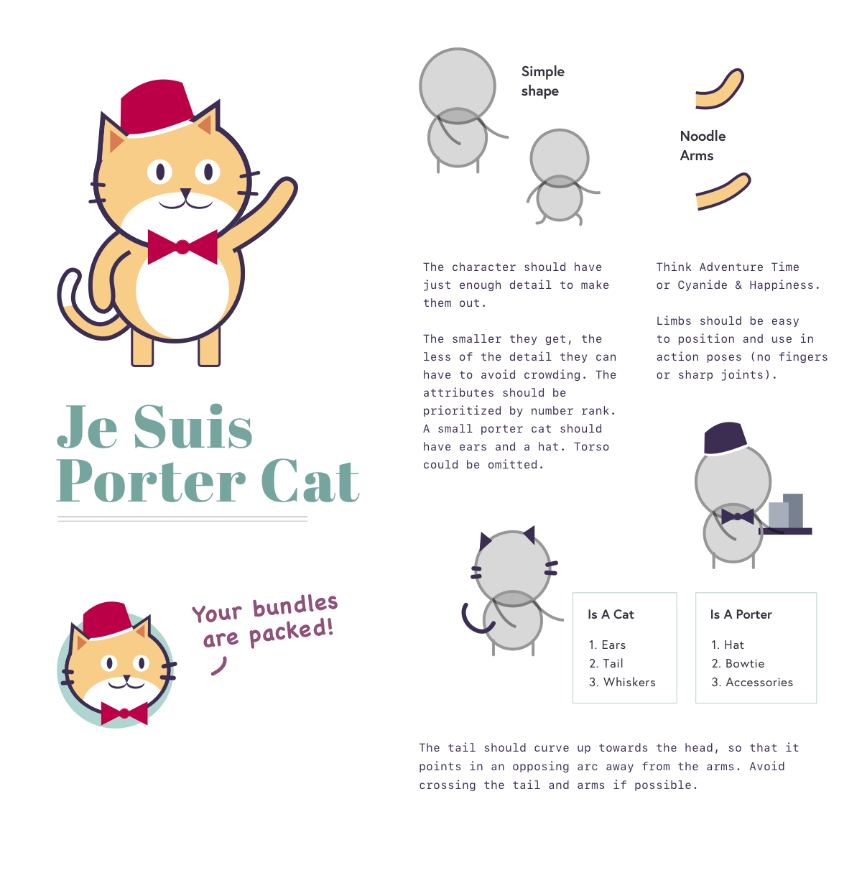
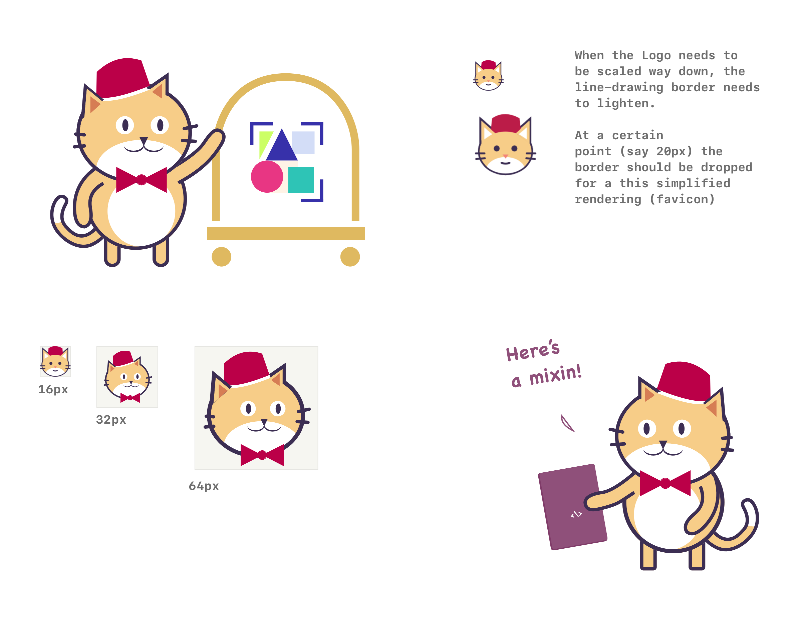

# Porter Branding & Assets 


## Logo

This `/art` directory contains the Porter brand assets Choose the format that works best for the scenario in which the logo is being used:

---

## Wordmark

Porter's wordmark is set in the [Abril](https://fonts.google.com/specimen/Abril+Fatface) typeface:


Abril is a bold display typeface created by Veronika Burian & José Scaglione (as [TypeTogether](http://www.type-together.com/)). These font files are licensed under the Open Font License.

* [Download Abril Fatface](https://fonts.google.com/specimen/Abril+Fatface)
* [Open Font License](https://scripts.sil.org/cms/scripts/page.php?site_id=nrsi&id=OFL)

Note: For normal page copy please pair a more legible typeface like [Open Sans](https://fonts.google.com/specimen/Open+Sans).

---

## Porter Cat






## Porter Color Palette:


### Color values: 

Primary (brand elements):

```
$gray:   #3C2E53; // ideal for text
$gold:    #DFB960;
```

Secondary (backgrounds, shading, accents):

```
$green:  #DDF5F2; // ideal for bg
$pink:   #CFBFD0;
```

Cat colors:

```
$red:     #AB2449;
$orange:  #F1CE91;
```

### Color examples:


